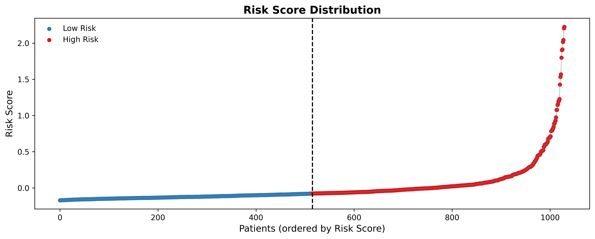
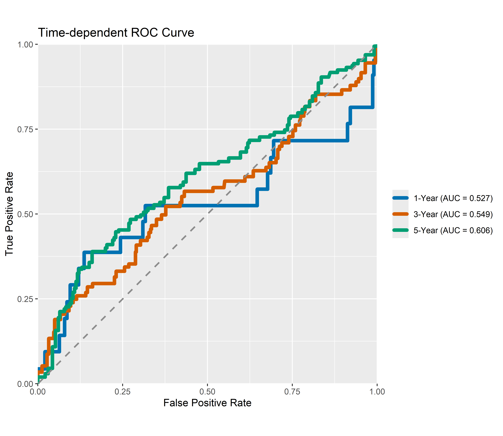
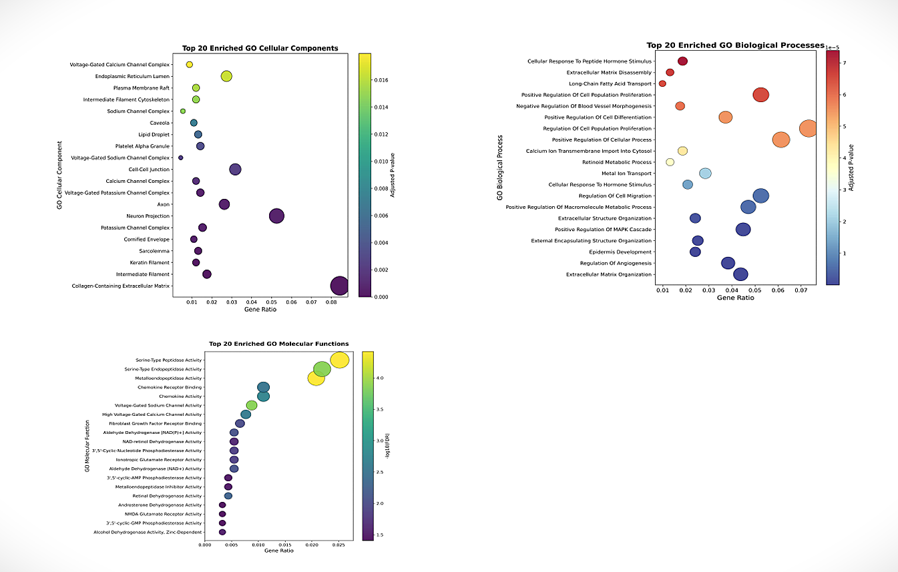
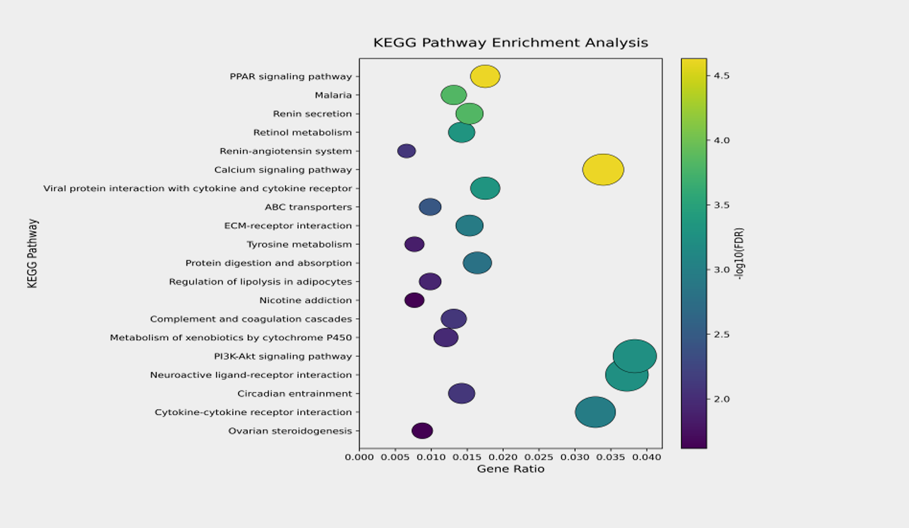
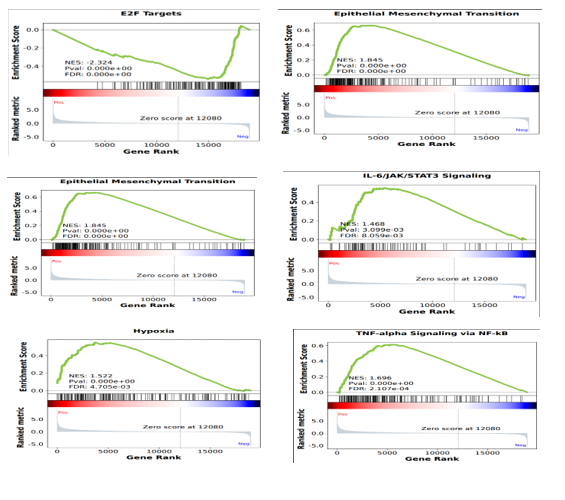
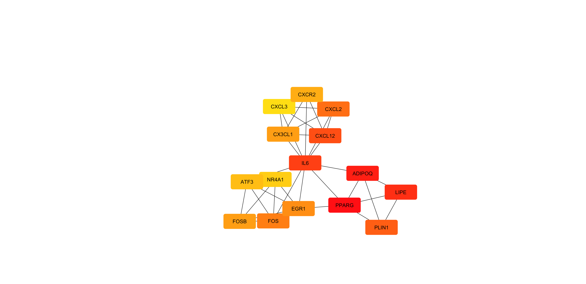

# # TCGA-BRCA Prognostic Model

Machine Learning-Based Breast Cancer Survival Risk Analysis Using Clinical and RNA-Seq Data from TCGA-BRCA

This project investigates breast cancer survival using clinical and
RNA-seq data from The Cancer Genome Atlas Breast Invasive Carcinoma
(TCGA-BRCA) cohort.

The study integrates clinical characteristics and gene-expression
data to identify prognostic genes and develop a  survival
risk model.

## Project Description

This project investigates breast cancer survival using clinical and
RNA-seq data from the TCGA-BRCA cohort. Survival-associated genes were
identified using Cox regression and LASSO-based feature selection,
followed by construction of a multigene prognostic risk model.
Patients were stratified into low- and high-risk groups, and the
associated molecular features were further investigated using
differential expression, GO, KEGG, GSEA, and protein–protein
interaction analyses.
## Overview 

Breast cancer is a heterogeneous disease with substantial variation in
patient survival and clinical outcomes. This project uses clinical and
RNA-seq data from the TCGA-BRCA cohort to investigate molecular
features associated with overall survival.

The study applies a stepwise computational workflow involving gene
quality control, variance filtering, univariate Cox regression,
LASSO-Cox feature selection, and multivariate Cox regression to
identify prognostic genes and construct a risk-score model.

Patients were stratified into low- and high-risk groups based on their
risk scores and evaluated using Kaplan–Meier survival analysis,
time-dependent ROC analysis, and Cox regression. Differentially
expressed genes between the risk groups were subsequently investigated
using GO, KEGG, and GSEA, followed by STRING-based PPI network and
hub-gene analysis to explore the biological context of the observed
risk-associated molecular profile.

The overall objective was to integrate clinical and transcriptomic
information to develop and biologically characterize a breast cancer
prognostic model using publicly available TCGA-BRCA data.
## Objectives

- Identify genes associated with breast cancer overall survival.
- Select prognostic features using Cox and LASSO-Cox analysis.
- Construct a multigene prognostic risk-score model.
- Stratify patients into low- and high-risk groups.
- Evaluate survival differences between risk groups.
- Investigate biological pathways associated with the risk phenotype.
- Identify candidate hub genes through PPI network analysis.
## Study Cohort/Data

- Dataset: TCGA-BRCA
- Cancer type: Breast Invasive Carcinoma
- Patients: 1,030
- Molecular data: RNA-seq gene expression
- Clinical data: Survival and clinicopathological variables

## Workflow / Methodology
1. RNA-seq data preprocessing
2. Clinical  data preprocessing
3. Gene quality control
4. Variance filtering
5. Feature standardization
6. Univariate Cox regression
7. FDR correction
8. LASSO-Cox feature selection
9. Multivariate Cox regression
10. Risk-score construction
11. KaplanMeier survival analysis
12. Time-dependent ROC analysis
13. Differential gene expression analysis
14. GO enrichment analysis
15. KEGG pathway enrichment
16. GSEA
17. PPI network analysis
18. Hub-gene identification
## Prognostic Model
Three genes were retained in the final prognostic model:

- **ABCB5**
- **XG**
- **AC011483.2**

The prognostic risk score was calculated using the expression
levels of the selected genes and their corresponding Cox regression
coefficients.

Patients were classified into low-risk and high-risk groups using
the median risk score as the cutoff.

## Results

### 1. Risk Score Distribution

Patients were stratified into low-risk and high-risk groups based on the
median prognostic risk score.

**Figure 1.** Distribution of prognostic risk scores among the study patients.

---

### 2. Kaplan–Meier Survival Analysis

![Kaplan-Meier overall survival curve comparing high-risk and low-risk groups. Two survival probability lines are shown, orange for High Risk and blue for Low Risk, with shaded confidence bands on a white chart with dashed grey grid lines. The plot title is Kaplan-Meier Overall Survival Curve, with axis labels Overall Survival Probability and Survival Time (Days). Text in the image includes High Risk, Low Risk, Log-rank p = 1.173e-03, and the at-risk table showing High Risk and Low Risk counts, censored values, and event counts. The tone is neutral and clinical.](figures/Kaplan_Meier_Publication.png)

**Figure 2.** Kaplan–Meier overall survival curves comparing low-risk and
high-risk patient groups.

---

### 3. Time-Dependent ROC Analysis

**Figure 3.** Time-dependent ROC curves evaluating the prognostic performance
of the risk-score model.

---

### 4. Differential Gene Expression Analysis

**Figure 4.** Volcano plot showing differentially expressed genes between
the low-risk and high-risk groups.

---

### 5. Gene Ontology (GO) Enrichment Analysis

**Figure 5.** Gene Ontology enrichment analysis of differentially expressed
genes.

---

### 6. KEGG Pathway Enrichment Analysis

**Figure 6.** KEGG pathway enrichment analysis of differentially expressed
genes.

---

### 7. Gene Set Enrichment Analysis (GSEA)

**Figure 7.** Gene Set Enrichment Analysis showing significantly enriched
gene sets and biological pathways associated with the risk groups.

---

### 8. Protein–Protein Interaction (PPI) Network Analysis

**Figure 8.** Protein–protein interaction network and hub-gene analysis.

## Repository Structure
TCGA-BRCA/
├── .vscode/
├── Data/
├── figures/
├── notebooks/
├── README.md
├── report/
│   └── TCGA_BRCA_Project_Report.pdf
├── results/
└── scripts/

## Tools & Technologies

- R
- Python
- RStudio
- Survival analysis
- Cox proportional hazards regression
- LASSO regression
- Differential expression analysis
- GO / KEGG enrichment
- GSEA
- STRING
- Cytoscape
- cytoHubba
## Reproducibility

The analysis scripts are organized in the scripts directory
according to the major stages of the workflow.

The results and figures generated during the analysis are provided
in the results directory.

Patient-level TCGA data are not redistributed in this repository.
Researchers should obtain the required data from the appropriate
TCGA/GDC resources.
## Project Report
The complete Project report describing the study,
methodology, analysis, results, and interpretation is available here:

## Limitations
- The prognostic model showed modest discriminatory performance.
- The analysis was based on a retrospective public dataset.
- External validation in an independent cohort was not performed.
- The identified genes and hub candidates require further biological
  and experimental validation.
- The model should not be interpreted as a clinically validated
  prognostic tool.

## Data Sources & Database References
The following publicly available resources and APIs were used to
access, process, annotate, or interpret biological and clinical data:

- **The Cancer Genome Atlas (TCGA) / Genomic Data Commons (GDC)**  
  Clinical and molecular data for the TCGA-BRCA cohort.  
  https://portal.gdc.cancer.gov/

- **National Cancer Institute (NCI)**  
  TCGA program and cancer genomics resources.  
  https://www.cancer.gov/

- **STRING Database**  
  Protein–protein interaction and functional association networks.  
  https://string-db.org/

- **Cytoscape**  
  Network visualization and analysis.  
  https://cytoscape.org/

- **Gene Ontology (GO)**  
  Functional annotation of genes and gene products.  
  https://geneontology.org/

- **KEGG**  
  Biological pathway annotation and pathway analysis.  
  https://www.genome.jp/kegg/

- **MSigDB**  
  Curated gene sets used for Gene Set Enrichment Analysis (GSEA).  
  https://www.gsea-msigdb.org/

- **Enrichr**  
  Gene-set and pathway enrichment analysis resource.  
  https://maayanlab.cloud/Enrichr/

## Acknowledgements

I sincerely thank **Dr. Nilofer Shaikh (Scientist, BioTecNika)** for her
guidance and scientific supervision, and **Mr. Shekhar Suman (Founder,
BioTecNika)** for providing the opportunity and research environment for
this project.

I also acknowledge the **Department of Biotechnology, Guru Jambheshwar
University of Science and Technology (GJUST), Hisar**, for academic
support and encouragement.

The authors acknowledge the **TCGA/NCI** resources for providing the
clinical and molecular data used in this study.
## References

1. The Cancer Genome Atlas (TCGA) / Genomic Data Commons (GDC).
2. Cox proportional hazards regression methodology.
3. LASSO regression methodology.
4. STRING database.
5. Gene Ontology Consortium.
6. KEGG database.
7. MSigDB / GSEA.
8. Cytoscape and cytoHubba.

## Author

**Mohd Jishan Ansari**

M.Sc. Biotechnology  
Guru Jambheshwar University of Science and Technology, Hisar

Research interests: Bioinformatics, Computational Biology, Molecular Biology, Cancer Biology and Personalized Medicine

GitHub: [ZeeshanAnsari1690](https://github.com/ZeeshanAnsari1690)  
Email: zeeshan.academic04@gmail.com
## Appendix

### Final Prognostic Genes

- ABCB5
- XG
- AC011483.2

### Model Evaluation

- Concordance Index (C-index): ~0.57
- Time-dependent AUC: ~0.53–0.61
- External validation: Not performed

### Differential Expression

- Significant protein-coding DEGs: 913

### Survival Parameters

- Endpoint: Overall Survival
- Risk-group cutoff: Median risk score
- Time-dependent ROC: 1-, 3-, and 5-year
- Survival comparison: Kaplan_Meier + log-rank test
